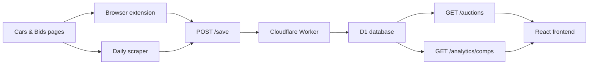

# Cars & Bids Labs

> A small lab stack for collecting, storing, exploring, and analyzing Cars & Bids auction data.

## At a Glance

| Layer | What it does | Tech |
| --- | --- | --- |
| `extension/` | Collects listing URLs and enriches auction details inside the browser | Chrome extension, vanilla JS |
| `cab-daily-scraper/` | Runs headless scraping jobs and uploads normalized data | Node.js, Puppeteer |
| `backend/` | Stores auction records and serves filters plus comp analytics | Cloudflare Workers, D1 |
| `cab-frontend/` | Browses auction history with filters and charts | React, MUI, Recharts |

## System Flow



## Why This Repo Exists

This workspace is built around one idea: make Cars & Bids auction data easier to capture and easier to explore.

- The extension helps gather live page data while browsing.
- The scraper gives you repeatable bulk collection.
- The backend normalizes and stores records with upsert behavior by `auctionId`.
- The frontend turns that dataset into a filterable comps browser.

## Repo Map

### `backend`
- Cloudflare Worker with three main routes:
  - `GET /auctions`
  - `GET /analytics/comps`
  - `POST /save`
- Uses a D1 database named `carsandbids`
- Handles filtering by make, model, year, horsepower, price, drivetrain, colors, sale type, and seller type

See [backend/readme.md](backend/readme.md).

### `cab-daily-scraper`
- Headless Puppeteer scraper for past auctions
- Writes daily JSON and CSV files to `output/`
- Uploads scraped results to the deployed backend

See [cab-daily-scraper/README.md](cab-daily-scraper/README.md).

### `cab-frontend`
- React app deployed to GitHub Pages
- Fetches paginated auction data from the worker
- Supports multi-field filtering and chart-based comps exploration

See [cab-frontend/README.md](cab-frontend/README.md).

### `extension`
- Manifest V3 content-script extension
- Injects a floating panel into Cars & Bids pages
- Can rescan URLs, enrich listings, and push individual records to the backend

See [extension/README.md](extension/README.md).

## Quick Start

Pick the part of the stack you want to work on:

```bash
cd backend
npm run dev
```

```bash
cd cab-frontend
npm start
```

```bash
cd cab-daily-scraper
npm start
```

For the extension, load [`extension/`](extension/) as an unpacked extension in Chrome.

## Nice README Direction

This repo now uses a cleaner "visual README" style without GIFs:

- short hero section
- compact architecture table
- Mermaid flow diagram
- folder-by-folder landing links
- command blocks that are easy to skim

That same structure also works well for a GitHub profile README: hero, focus areas, current projects, featured repos, and a simple architecture or workflow diagram instead of animation.

test commit 1
