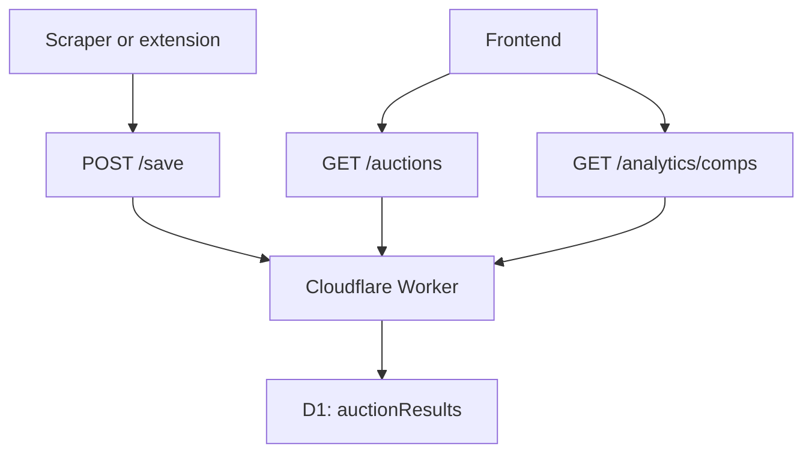

# Cars & Bids Labs Backend

> Cloudflare Worker + D1 API for auction search, comp analytics, and upsert-based ingestion.

## Snapshot

| Area | Details |
| --- | --- |
| Runtime | Cloudflare Workers |
| Database | Cloudflare D1 (`carsandbids`) |
| Entry | `src/index.js` |
| Routes | `GET /auctions`, `GET /analytics/comps`, `POST /save` |
| Local dev | `npm run dev` |

## Request Flow



## What It Handles

- saves auction records with `auctionId`-based upsert logic
- returns paginated auction results ordered by `endDate`
- supports rich filtering across make, model, year, horsepower, price, drivetrain, colors, sale type, and seller type
- computes comp summaries like average sold price, median sold price, sell-through rate, and pricing insights

## Key Files

| File | Responsibility |
| --- | --- |
| `src/index.js` | Router and route dispatch |
| `src/api/auctions.js` | Paginated search + filtering |
| `src/api/analytics.js` | Comp summaries and insights |
| `src/api/save.js` | Insert/update auction records |
| `migrations/` | D1 schema history |
| `wrangler.toml.example` | Publish-safe Worker and D1 binding template |

## Commands

```bash
npm install
npm run dev
```

Before running locally, create `wrangler.toml` from `wrangler.toml.example` and fill in your real D1 values.

```bash
npm run deploy
```

```bash
npm run migrate
```

## API Surface

### `GET /auctions`

Returns paginated auction results. Common query params include:

- `page`
- `limit`
- `make`
- `model`
- `minYear` / `maxYear`
- `minHp` / `maxHp`
- `minPrice` / `maxPrice`
- `transmission`
- `drivetrain`
- `bodyStyle`
- `exteriorColor`
- `interiorColor`
- `saleType`
- `sellerType`

### `GET /analytics/comps`

Returns comp summary data for a make/model pair, including:

- average sold price
- median sold price
- sell-through rate
- average mileage
- average bids
- simple insight strings relative to the target listing

### `POST /save`

Accepts a normalized auction payload and upserts it into `auctionResults`.

## Manual D1 Migration Recovery

If a migration failed but the schema already matches, you can manually mark it as applied and continue.

### 1. Check pending migrations

```bash
npx wrangler d1 migrations list DB
```

### 2. Mark a failed migration as applied

Example for `0003.sql`:

```bash
npx wrangler d1 execute DB --local --command "INSERT INTO d1_migrations (name, applied_at) VALUES ('0003.sql', datetime('now'));"
```

### 3. Verify the migration is skipped

```bash
npx wrangler d1 migrations list DB
```

### 4. Apply the remaining migrations

```bash
npx wrangler d1 migrations apply DB
```

## Notes

- Use `--local` for the local D1 database.
- Add `--remote` to run against the deployed instance.
- Wrangler logs are typically under:

```text
C:\Users\<username>\AppData\Roaming\xdg.config\.wrangler\logs\
```
