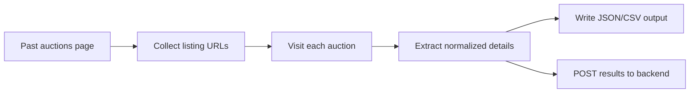

# Cars & Bids Daily Scraper

> Headless scraping job for past auctions, with local exports and backend upload support.

## Snapshot

| Area | Details |
| --- | --- |
| Runtime | Node.js |
| Browser automation | Puppeteer + stealth plugin |
| Entry | `src/core/scraper.js` |
| Output | `output/YYYY-MM-DD.json` and `.csv` |
| Upload target | `https://backend.carsandbids-labs.workers.dev/save` |

## Flow



## What It Does

- opens Cars & Bids past auctions
- collects listing URLs
- enriches each auction with detailed fields
- writes results to daily JSON and CSV files
- uploads cleaned payloads to the backend
- updates existing records when the same `auctionId` appears again

## Commands

```bash
npm install
npm start
```

Run a smaller local test:

```bash
node src/core/scraper.js --limit=10
```

## Project Layout

| Path | Responsibility |
| --- | --- |
| `src/core/scraper.js` | Main run loop |
| `src/core/url-collector.js` | Pulls listing URLs from the results page |
| `src/core/detail-extractor.js` | Extracts detailed auction data |
| `src/core/utils.js` | Shared helpers |
| `output/` | Daily exports |
| `cb-profile/` | Browser profile data used during scraping |

## Behavior Notes

- Uses a stealth plugin to reduce automation fingerprints.
- Waits between enrich steps to avoid overly aggressive traffic patterns.
- Detects common Cloudflare challenge pages.
- Saves a screenshot if the scraper stays blocked.
- Reverses processing order so newer listings get higher IDs in the current workflow.

## Expected Output

Each run creates:

- a JSON file with normalized auction results
- a CSV export for quick spreadsheet inspection
- backend save attempts for each successfully enriched auction
