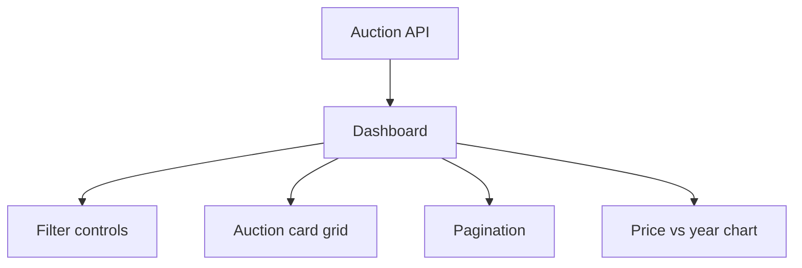

# Cars & Bids Frontend

> React dashboard for browsing stored auction history with filters, pagination, and comps visuals.

## Snapshot

| Area | Details |
| --- | --- |
| Framework | React |
| UI | MUI |
| Charts | Recharts |
| Router base | `/carsandbids-labs` |
| Data source | `https://backend.carsandbids-labs.workers.dev` |

## Interface Shape



## What It Includes

- make and model filters
- transmission, drivetrain, body style, sale type, and seller type filters
- range filters for year, horsepower, and price
- free-text color filters
- paginated auction browsing
- chart rendering when a make and model are selected

## Commands

```bash
npm install
npm start
```

Build for production:

```bash
npm run build
```

Deploy to GitHub Pages:

```bash
npm run deploy
```

## Important Files

| File | Responsibility |
| --- | --- |
| `src/App.js` | Theme and route setup |
| `src/pages/Dashboard.js` | Main filter and results experience |
| `src/api.js` | Backend API client |
| `src/components/` | Cards, charts, and shared UI |

## Notes

- The app currently uses a deployed Cloudflare Worker as its API base.
- There is a commented local API base in `src/api.js` for local backend work.
- The GitHub Pages homepage is configured in `package.json`.
