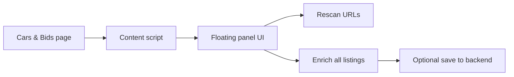

# Cars & Bids Browser Extension

> Manifest V3 extension that injects a floating panel into Cars & Bids pages for URL collection and detail enrichment.

## Snapshot

| Area | Details |
| --- | --- |
| Type | Chrome extension |
| Manifest | V3 |
| Target site | `carsandbids.com` |
| Entry point | `content.js` |
| UI style | Injected floating control panel |

## Interaction Flow

## What It Does

- injects a panel on Cars & Bids pages
- scans the current page for listing URLs
- enriches listings with parsed details
- preserves page order when needed
- lets you save individual parsed records to the backend from the panel

## Main Files

| File | Responsibility |
| --- | --- |
| `manifest.json` | Extension configuration |
| `content.js` | Bootstraps the extension on matching pages |
| `panel-ui.js` | Floating panel and action buttons |
| `url-collector.js` | Finds listing URLs on the page |
| `detail-extractor.js` | Parses auction details |
| `enricher.js` | Orchestrates enrichment |
| `utils.js` | Shared DOM and helper logic |

## Dev Setup

1. Open `chrome://extensions/`
2. Enable **Developer mode**
3. Click **Load unpacked**
4. Select the `extension/` folder
5. Visit [Cars & Bids](https://carsandbids.com)
6. Confirm the floating panel appears on the page

## Notes

- The extension matches both `carsandbids.com` and `www.carsandbids.com`.
- The panel supports rescan, enrich-all, and ordered enrichment actions.
- Individual enriched blocks can be sent directly to the backend save endpoint.
